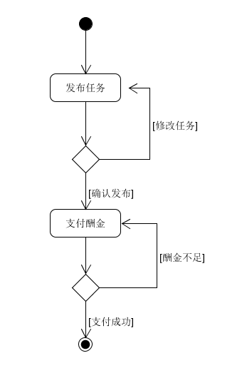
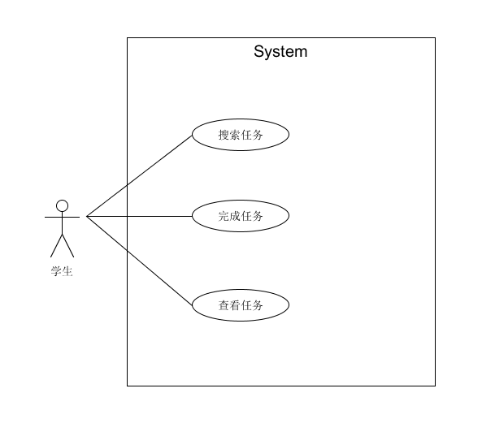
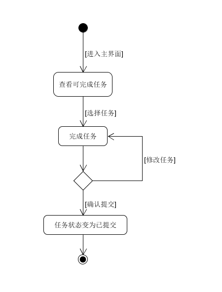

# Usecase Cases

## 详述用例 Use case 1 用户发布任务

**范围** ：挣闲钱系统

**级别** ：用户目标

**主要参与者**：“奶牛”

**涉众及关注点**：
- “奶牛”：希望能够便捷、清晰地查看所有可发布任务。希望便捷地发布一个新的任务，希望学生能够很好地查看并参与发布的任务。同时可以随时查看当前任务获得的结果。
- 学生：希望能够接收到任务，赚取闲钱币。
- 支付授权服务：希望接受到格式和协议正确的数字授权请求。希望准确发布任务的报酬。 

**前置条件**：“奶牛”与学生必须先通过微信登录认证。

**成功保证（后置条件）** ：存储任务信息。更新任务信息。记录账户闲钱币的变更。

**主成功场景(或基本流程)**：
1. "奶牛"通过进入界面了解可发布的任务。
2. "奶牛"选择发布的任务类型。
3. "奶牛"填写任务的详细内容。
4. "奶牛"确认任务的薪酬。
5. 系统推送任务到客户端。
6. 学生通过进入界面查看到发布的任务信息。
7. 学生接受发布任务 。
8. 学生完成发布的任务。
9. 系统记录完整的任务信息，并将任务完成信息发送到账务系统(进行闲钱币的转移)和任务管理系统(更新任务信息)。
10. "奶牛"收到用户完成的任务结果。

**扩展(或替代流程)**：

- 3a. "奶牛"在填写任务详细内容过程中退出小程序：
1. 系统清除当前"奶牛"填写的任务信息。
2. "奶牛"重新进入系统后，重新填写任务详情信息。
- 4a. "奶牛"发布的任务薪酬大于当前的闲钱币余额：
1. 跳出弹窗提醒当前余额不足，重新填写任务薪酬。
- 4b. "奶牛"发布任务薪酬小于等于0
1. 提示禁止零元交易，重新填写任务薪酬
- 8a. 学生在填写任务详细内容过程中退出小程序：
1. 系统保留学生接受任务的状态，清除学生任务完成的信息。
2. 学生重新进入系统后，重新回答任务。

**特殊需求**
- 支持文本显示的语言国际化。

**技术与数据变元表**：
5a. 推送出的任务可以通过二维码的形式进行传播。

**发生频率** ：可能会不断地发生。

**未解决问题**：
- 学生随意填写任务内容，如何保证任务高质量的完成。
- 研究远程服务的恢复问题
- 系统如何赚取手续费

## 非正式用例
### Use Case 2.1

**主成功场景**："奶牛"确认任务类型后，进行任务发布界面，填写好任务具体内容后，点击确认，系统提示是否确认提交任务，"奶牛"点击确定后，系统提示输入任务酬金，"奶牛"输入酬金并确认，任务发布成功，等待学生完成任务。

**交替场景**：
    
- "奶牛"点击确认后发现需要修改任务，点击取消返回任务编写页面。
- 如果系统检测到"奶牛"的余额不足以支付酬金，则跳转回酬金确认页面"奶牛"重新输入酬金。

**用例图**：

**活动图**：

### Use Case 2.2 学生完成任务

**主成功场景**：学生查看到"奶牛"发布的任务后，完成问卷或简历，点击提交，确认并提交任务，任务页面显示已提交，学生获得酬金。

**交替场景**:

- 学生想要修改填写内容，在确认页面选择取消，取消后返回任务填写界面，修改填写内容。
- 学生完成任务后，想要再次完成任务。任务界面应显示任务已提交，不能再重复完成该任务。
- 学生在完成任务过程中，任务已经到了截止时间，则学生无法提交该任务，返回主界面

**用例图**

**活动图**

## 简述用例

### Use case 3.1 查看推荐任务

- Actor: 学生
- Type: Primary
- Description: 学生进入小程序，切换到任务推荐界面，浏览自己感兴趣的任务，并进入任务详情页面完成任务。

### Use Case 3.2 新增菜品
- Actor："奶牛"
- Type：Primary
- Description："奶牛"发布了多个任务，"奶牛"可以选择各个任务的优先级，确保重要的任务优先被完成，进入已发布任务界面，提高重要任务的优先级，并点击确认，打开小程序，查看推荐页面中可以看到该任务，修改成功。

