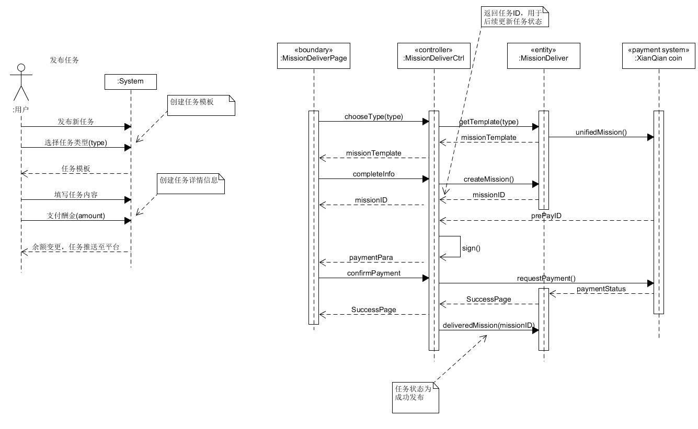
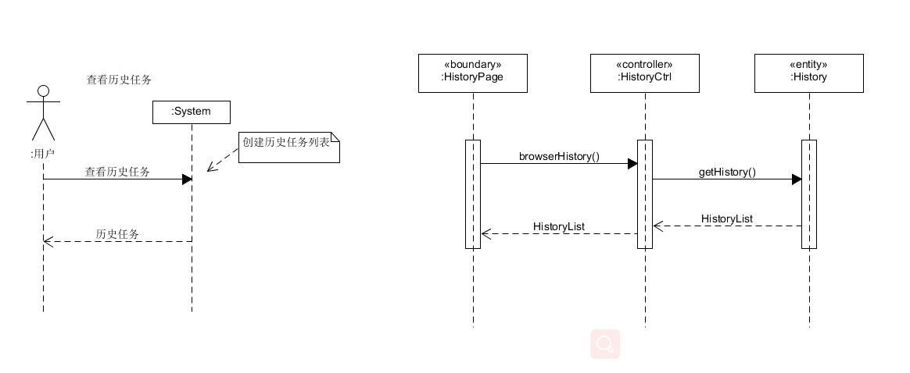

# System Sequence Diagram （功能模型）

根据我们的[用例分析](06-02-use-cases.md)

## 基本功能

1. 查看任务列表
2. 发布任务
3. 查看任务详情
4. 完成任务
5. 查看历史任务
6. 搜索任务

用户可以获取平台推送的任务，发布新的任务，完成平台推送的任务，并可以查看已完成的任务。

## 系统顺序图

### 1. 查看任务列表

用户进入主菜单页面查看平台推送的任务

### 2. 发布任务

用户发布一个新的任务

### 3. 查看任务详情

用户进入任务页面查看详情

### 4. 完成任务

用户完成平台上推送的任务

### 5. 查看历史任务

用户查看发布/完成的历史任务

### 6. 搜索任务

用户搜索想要查询的任务

