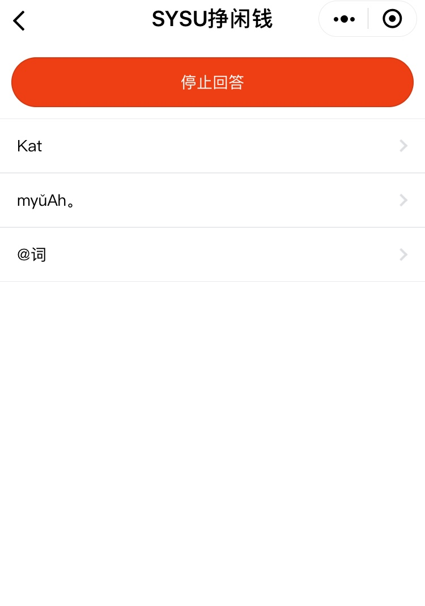

# UI界面设计

&nbsp;&nbsp; 

## 登录/注册界面

登录后可查看问卷列表、简历列表和个人主页

## 问卷列表界面

点击item可进入问卷进行填写

### 问卷填写

## 简历列表界面

点击item可进入简历进行填写

### 简历填写

## 个人主页

包含个人信息、发布问卷按钮、查询我收到的问卷回答按钮、征集简历按钮、查询我收到的简历按钮

### 查询余额

### 发布问卷

### 我收到的问卷回答

### 征集简历

### 我收到的简历

## 查询页面

