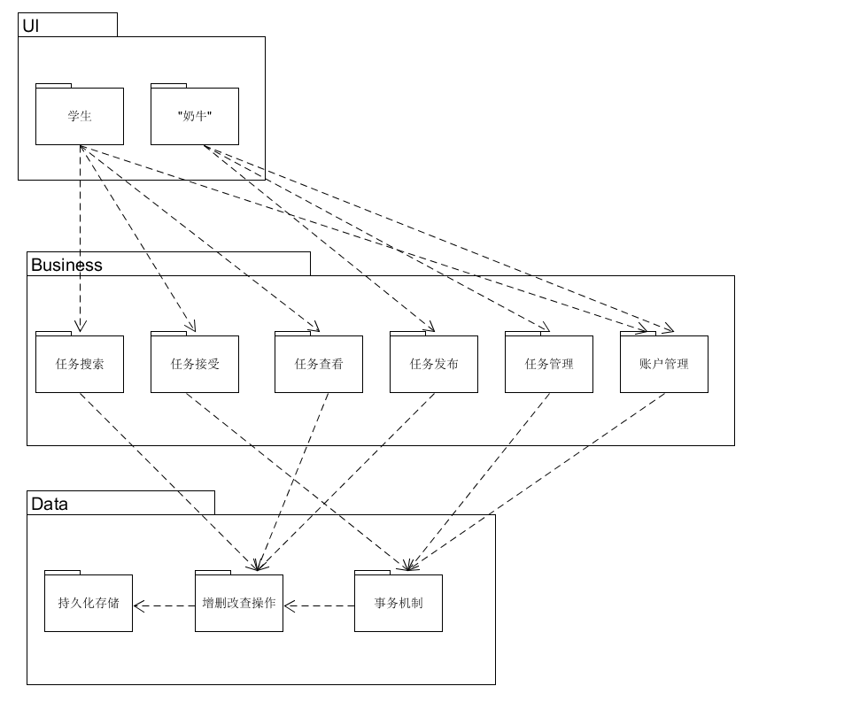
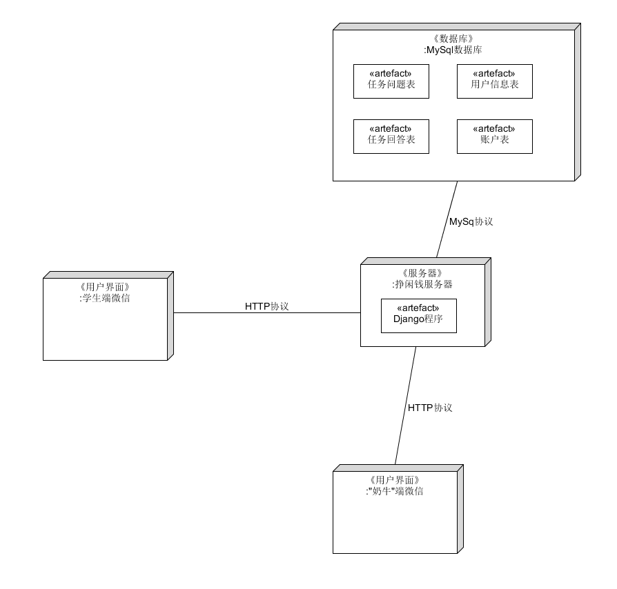

# Software Architecture Document

## 架构问题

### 可靠性和可恢复性

* 因素：小程序使用过程中出现访问服务端中断问题并恢复。
* 度量和质量场景：当向程序访问服务端出现中断，若工作环境正常，如在1min内检测到恢复，则重新建立链接。
* 可变性：在能够重新建立连接之前，可以在客户端进行简化服务。
* 该因素对涉众、架构以及其它因素的影响：小程序使用者的访问数据可能会发生丢失，无法传递至服务器。
* 对于成果的优先级：高
* 困难或风险：中等

### 可支持性和可适用性

* 因素：支持多种可变的第三方服务(如支付系统等)
* 度量和质量的场景：当小程序访问第三方系统时能够正常建立连接。
* 可变性：对于不同的第三方服务需要不同的可连接接口。
* 该因素对涉众、架构以及其它因素的影响：可提高小程序的可扩展性。
* 对于成功的优先级：中等
* 困难或风险：中等

## 解决方案说明

### 如何提高服务器性能

* 增加服务器内存
* 设置服务器最大使用人数，避免服务器负载超负荷
* 将动态数据利用缓存文件存储，前端直接调用缓存文件，而非直接访问数据库
* 优化数据库查询SQL，避免代价过高的查询，每次查询仅返回需要的结果，同时设置查询时间间隔，避免短时间的大量SQL查询
* 为数据库适当建立索引
* 数据库定期备份，当数据库出现故障或因操作失误等引起的数据丢失时可以恢复数据

## 逻辑视图

## 物理视图

