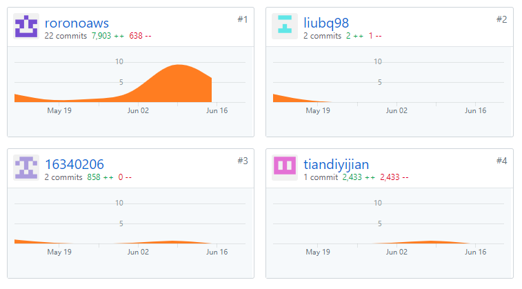
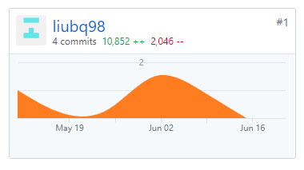
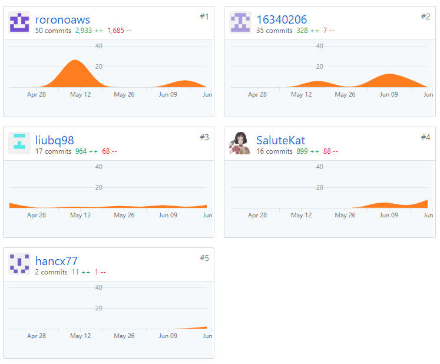
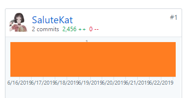

## PSP2.1 汇总表  
  
| PSP 2.1 | Personal Software Process Stages	 | 16340146  | 16340160	  | 16340067  | 16340206  | 16340162  |  
| :---------------: | :---------------: | :------: | :------: | :------: | :------: | :------: |   
|  **Planning**   |     **计划**       | 10 |  |  |  | 10 |  
|  estimate   |    预估任务时间        | 10 |  |  |  | 10 |  
|  **Development**   |      **开发**      | 70 |  |  |  | 80 |
|   analysis  |    需求分析        | 10 |  |  |  | 10 |  
|  design spec   |     生成设计文档       | 5 |  |  |  | 5 |  
| estimate    |      设计复审（与前端团队成员审核设计文档）      | 5 |  |  |  | 6 |  
|  coding standard   |      代码规范      | 3 |  |  |  | 2 |  
|   design  |     具体设计，包括绘制 UI，设计架构等       | 15 |  |  |  | 15 |   
|  coding   |    具体编码        | 30 |  |  |  | 25 |  
|  code review   |     代码复审       | 5 |  |  |  | 5 |  
|  test   |     测试（修改代码）       | 15 |  |  |  | 12 |  
|  **Report**   |     **报告**       | 20 |  |  |  | 10 |  
|  test report   |     测试报告       | 1 |  |  |  | 1 |  
|  size measurement   |       计算工作量     | 1 |  |  |  | 1 |  
|   postmortem & process improvement plan  |    每次迭代结束后写总结文档，并提出改进计划        | 10 |  |  |  | 8 |  

## 项目所有仓库贡献图表截图
### client

### server

### Dashboard

### Back-End-Go

## 综合贡献度分配  
  
| 制品 | 	 | 16340146  | 16340160	  | 16340067  | 16340206  | 16340162  |  
| :---------------: | :---------------: | :------: | :------: | :------: | :------: | :------: |   
|  源代码   |     客户端、服务端仓库，client       |  |  |  | 20% | 80% |  
|     |     服务端仓库，server       | 100% |  |  |  |  |  
|     |     文档仓库，Dashboard       | 22% | 22% | 4% | 30% | 22% |  
|     |     部分后端仓库，Back-End-Go       |  | 100% |  |  |  |  
|   分析与设计 |     UI设计        | 20% |  |  | 40% | 40% |  
|     |     数据库设计       | 60% |  |  |  | 40% |  
|  展示与测试   |       作品展示与测试     | 15% | 15% | 40% | 15% | 15% |  
|  综合贡献   |            | 20% | 19% | 10% | 21% | 30% |  
